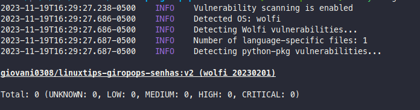

# LINUXtips-giropops-senhas
Projeto referente ao **Desenvolvimento e Otimização Segura de Aplicações Kubernetes** do **Programa Intensivo em Containers e Kubernetes (PICK)** oferecido pela plataforma https://www.linuxtips.io/

## Sobre o projeto
### Aplicação

A aplicação Giropos Senhas consiste em uma aplicação web que permite ao usuário gerar senhas aleatórias com base em parâmetros como tamanho da senha, incluindo ou não algarismos e/ou caracteres especiais. Ela permite o armazenamento das senhas em memória.

#### Tecnologias utilizadas:
 - Python: https://www.python.org/
 - Flask: https://flask.palletsprojects.com/en/3.0.x/
 - Redis: https://redis.io/
 - Tailwind: https://tailwindui.com/?ref=top

#### Implantação
 As tecnologias utilizadas para a implantação do projeto foram:
  - Docker: https://www.docker.com/
  - kind: https://kind.sigs.k8s.io/
  - kubectl: https://kubernetes.io/docs/tasks/tools/install-kubectl/


#### Sobre a imagem
Para a imagem base foi utilizada uma image distroless da chainguard ([link](https://edu.chainguard.dev/chainguard/chainguard-images/reference/python/)) o que garante uma maior segurança.


### Executar a Aplicação usando Docker Compose

```bash
docker compose -f docker/docker-compose.yaml up -d --force-recreate
```